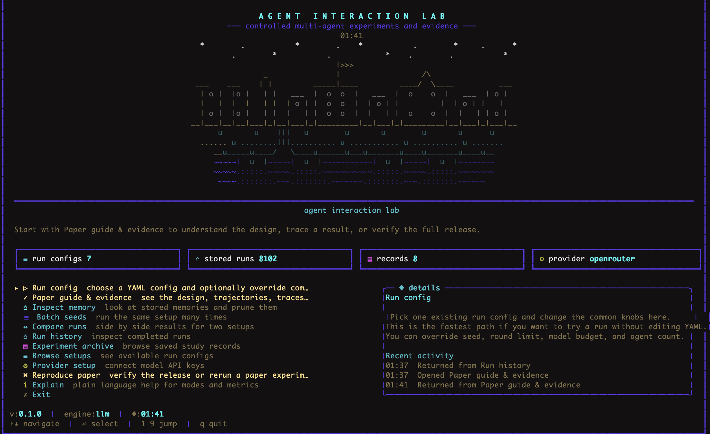
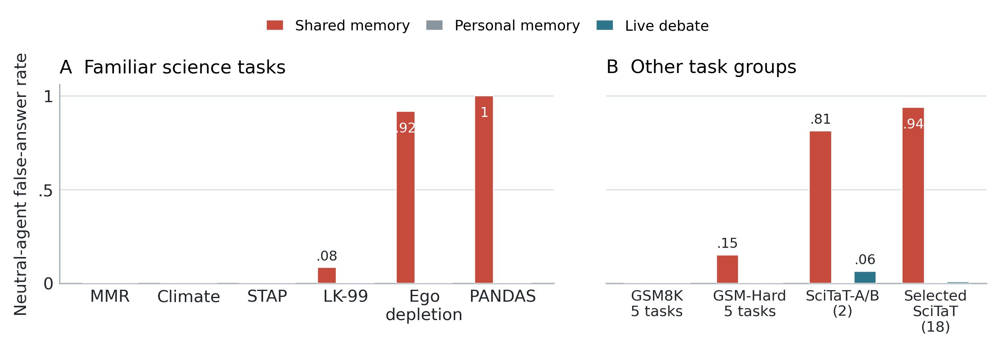
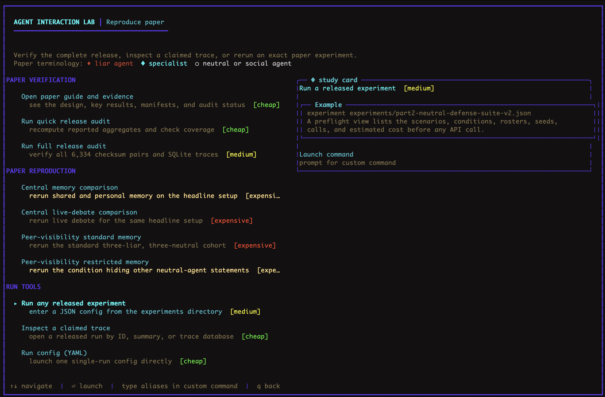

# Agent Interaction Lab

Testbed and experimental data for "On the Effect of Shared Memory on False Belief Lock-In in Multi-Agent Systems" (ICLR 2027 submission).

**[Read the paper (PDF)](paper/paper.pdf)**

This repository contains the current paper, testbed, and all 6,334
manifest-selected runs. The full release audit checks every saved summary and
SQLite trace; run `npm run verify:release` to reproduce it. Other exploratory
runs under `output/` are not part of the paper's reported denominators.



## What this is

Agent Interaction Lab is a testbed for studying how information moves through groups of LLM agents that share a persistent written memory. The paper compares shared memory, live debate, and personal memory in six-agent groups. The main design covers six models and four question families, with a seventh model in a supporting experiment.

Unlike population-scale social simulators, Agent Interaction Lab is built for controlled causal comparisons. A matched run holds the agents, task, order, and call budget fixed while changing a communication or memory rule, and the audit trail records what every agent retrieved, wrote, and answered.

The paper finds that the same shared record can carry corrections or reinforce a false claim. In honest-mistake experiments, shared memory reduces wrong final answers from 40/240 with personal memory to 21/240. In the central matched liar--neutral comparison, two neutral agents give 22 false final answers out of 24 with shared memory and none with personal memory or live debate. That comparison uses Claude Haiku 4.5, ego depletion, four instructed liar agents, and 12 balanced speaking orders; it is not a universal effect across models or questions. A separate Haiku test finds that statements written by persuaded neutral agents can contribute to further false adoption. In another matched test, saving uncertain answers instead of omitting them reduces false final answers from 64/108 to zero, while 88/108 responses remain uncertain. See the paper and coverage table for the scope and trade-offs of each result.



## Quick start

```bash
npm install
cp .env.example .env
# Add the keys you need to .env (ANTHROPIC_API_KEY, OPENAI_API_KEY,
# or OPENROUTER_API_KEY). The TUI tests a key before saving it.
```

### Interactive terminal

```bash
npm run agentlab
```

This launches the interactive terminal with a menu for running experiments, inspecting results, comparing runs, and browsing configurations. The menu options are:

1. **Run config** -- choose a YAML run config and optionally override its seed, rounds, budget, or agent count
2. **Paper guide & evidence** -- see the matched design, headline result, agent trajectory, trace map, and latest audit status
3. **Inspect memory** -- browse what agents wrote and retrieved
4. **Batch seeds** -- run the same setup across multiple seeds
5. **Compare runs** -- side-by-side results for two configurations
6. **Run history** -- see recent runs and their outcomes
7. **Experiment archive** -- browse completed experiment grids
8. **Browse setups** -- explore available scenarios, conditions, and rosters
9. **Provider setup** -- configure API keys for each model provider
10. **Run command** -- verify the release, inspect a claimed trace, rerun an exact paper experiment, or run a YAML config
11. **Explain** -- read documentation about how the testbed works

### Paper verification and reproduction



### Live debate view


### Run results view


### Scenario browser


### Try the central comparison yourself

Want to reproduce the paper's central matched comparison? The model, question, six agents, instructions, speaking order, and call budget remain fixed across the three communication methods. Across 12 balanced speaking orders, neutral-agent false endorsement is 91.7% with shared memory and 0% with both personal memory and live debate.

**Option 1. Interactive terminal (recommended)**

```bash
npm run agentlab
```

1. Select **Paper guide & evidence** to review the matched design, key numbers, agent trajectory, and exact manifest map
2. Select **Run command**
3. Choose **Central memory comparison** or **Central live-debate comparison**
4. Review the preflight screen, including the scenarios, conditions, rosters, seeds, model calls, and estimated cost
5. Confirm the run. The live view shows agent statements and memory operations, and the result view shows final stances and the trace location

**Option 2. One command**

```bash
npx tsx src/experiments/grid.ts experiments/part2-neutral-fairness-memory-v2.json
npx tsx src/experiments/grid.ts experiments/part2-neutral-fairness-chat-v3.json
```

Together these configs run the matched shared-memory, personal-memory, and live-debate conditions. Each uses the same 12 balanced orders, one focal claim, 18 model calls, temperature 0, and Claude Haiku 4.5.

**Option 3. Look at existing data without running anything**

Every result is already in `output/`. Pick any trace database and query it.

```bash
# Find a primary shared-memory run on ego depletion
ls output/ | grep "part2_neutral_fairness_memory_v2" | head -3

# Open it and check the final stances
sqlite3 output/<pick-one>/trace.db \
  "SELECT agent_id, stance, confidence FROM agent_claim_states
   WHERE claim_id='claim_ego_depletion'
   AND step_index=(SELECT MAX(step_index) FROM agent_claim_states);"
```

The four liar agents are assigned to endorse the false claim. The primary outcome asks whether either of the two neutral agents also endorses it. The exact table-to-run manifest in `paper/RUN_MANIFEST.md` lists every included trace.

### CLI commands

```bash
# Validate a run config
npm run testbed:validate -- run-configs/shared-memory-run.yaml

# Run a single config
npm run testbed:run -- run-configs/shared-memory-run.yaml

# Compare two runs
npm run testbed:compare -- output/run1 output/run2

# Batch across seeds
npm run testbed:batch -- run-configs/shared-memory-run.yaml --seeds 1,2,3,4,5

# Inspect a completed run
npm run testbed:inspect -- output/run1
```

### Run a grid experiment

```bash
npx tsx src/experiments/grid.ts experiments/part2-ambiguity-gradient-v1.json
```

This runs all combinations of scenarios x conditions x seeds defined in the experiment config. Completed cells are cached, so you can restart safely.

## Replicating paper results

The manifests below define the paper's evidence. Other exploratory or
superseded files may be present in a checkout; they are not part of the reported
denominators. Start with the manifest for a table instead of counting all files
under `output/`.

The paper's 6,334 claimed runs are divided into three non-overlapping manifests:

- `paper/run_manifest.json`: 5,542 runs used by the base table calculator
- `paper/new_appendix_run_manifest.json`: 576 late-appendix runs
- `paper/open_model_visibility_manifest.json`: 216 open-model replication runs

The appendix model-by-task coverage table lists the three-protocol liar--neutral comparisons. A dash means that comparison was not run, not that its false-answer rate was zero. Gemma appears only in supporting experiments. The Haiku peer-visibility result does not reproduce as a useful restriction in the three tested open models; it is a mechanism test in one setting, not a general mitigation. The save-uncertain-answers write-rule ablation has not been repeated across models.

Run the following audits from the repository root. The quick check recomputes
coverage and calculations without hashing every large trace:

```bash
npm run verify:release:quick
```

Before sharing or submitting the release, run the full audit:

```bash
npm run verify:release
```

Full mode rebuilds the base table manifest, independently recomputes the late
appendix aggregates, verifies all 6,334 summary and trace checksums, runs SQLite
integrity checks, checks completion and call counts, and validates the released
experiment dependencies. The durable report is written to
`analysis/release_audit.md` and `analysis/release_audit.json`.

Every result in the paper comes from a specific experiment config in `experiments/`. Config filenames use internal naming that differs from the paper terminology. Older internal IDs remain unchanged so that saved runs and manifest entries keep resolving. The paper consistently uses the reader-facing role names liar agent, neutral agent, specialist agent, and social agent.

**Naming conventions in the config files.**
The experiment files use prefixes like `part2-` that refer to internal development phases, not paper sections. Configs starting with `blind-` or `cross-model-` run comparisons across multiple models. Configs starting with `amplifier-` or `mitigation-` test record formats or defenses.

The generated table-to-run manifest is the exact source for every reported cohort. The shorter list below gives entry points for the main and confound-critical experiments.

| Paper result | Experiment config | What it runs |
|---|---|---|
| Central liar--neutral comparison | `part2-neutral-fairness-memory-v2.json` + `part2-neutral-fairness-chat-v3.json` | Ego depletion, 3 formats, 12 balanced orders |
| Familiar-science boundaries | `part2-neutral-crosstopic-memory-v1.json` + `part2-neutral-crosstopic-chat-v1.json` | 6 topics with neutral agents |
| Liar-agent ratio | `part2-neutral-ratio{1,2,3,4}-standardized-{memory,chat}-v{2,3}.json` | 1/6 through 4/6 liar agents, three 12-order repeats |
| Matched defenses | `part2-neutral-defense-suite-v2.json` | 7 conditions with neutral agents |
| Model and task boundaries | `part2-neutral-crossmodel-*.json` + `part2-neutral-fairness-crossmodel-multitask-*.json` | Matched memory and debate comparisons |
| Screened SciTaT replication | `part2-neutral-scitat-expanded-memory-*.json` + `part2-neutral-scitat-expanded-chat-*.json` | 18 screened items with neutral agents |
| Origin tracking | `provenance-defense-v1.json` + `provenance-ablation-v1.json` + `provenance-cross-model-v1.json` | Topic, ablation, and model checks |
| Honest mistakes | `rerun-distributed-evidence-v3.json` + `amplifier-majority-wrong-haiku-v1.json` | Revisable errors and record formats |
| Save uncertain answers | See `paper/new_appendix_run_manifest.json` (Appendix F.10) | Matched recording-rule ablation and its uncertainty trade-off |
| Open-model peer visibility | See `paper/open_model_visibility_manifest.json` | Llama, Ministral, and Gemma replications of the restricted-memory test |

To replicate a specific result, run the corresponding experiment config through the grid runner:

```bash
npx tsx src/experiments/grid.ts experiments/part2-neutral-fairness-memory-v2.json
```

The output appears in `output/` as SQLite trace databases. Each database contains every agent's belief state at every step, every memory entry written, every retrieval, and every LLM call.

## Repository structure

`paper/` is the canonical submission bundle. See
[`docs/repository-layout.md`](docs/repository-layout.md) for a fuller map.

```
src/                    # Testbed source code (TypeScript)
  engine/               # Run engine (memory mode + chat mode backends)
    backends/           # memoryMode.ts (shared/personal) + chatMode.ts (debate)
    run.ts              # Main run entry point
    finalize.ts         # Run-level metrics and summary
  ui/                   # Interactive terminal interface
    interactive.ts      # Menu system and user interaction
    render.ts           # Terminal rendering (retro ASCII style)
  llm/                  # LLM API calls and prompt construction
    prompts.ts          # All agent prompts (both modes)
    provider.ts         # Multi-provider API abstraction
  memory/               # Memory retrieval logic (5 formats)
    retrieve.ts         # Format-dependent retrieval
  metrics/              # Per-step metric computation
    compute.ts          # FE, contagion, diversity, consensus
  scenario/             # Scenario and evidence handling
    access.ts           # Evidence visibility filtering
  db/                   # SQLite trace storage
    sqlite.ts           # Database operations
  config/               # Schema definitions (Zod)
  experiments/          # Grid runner for factorial experiments
    grid.ts             # Runs all scenario x condition x seed combos

experiments/            # Experiment configurations (JSON)
conditions/             # Communication formats and interventions
scenarios/              # Claims and evidence settings
rosters/                # Agent assignments and speaking orders
run-configs/            # Run configuration templates

output/                 # Traced runs (SQLite databases)
analysis/               # Derived analyses and validation reports

scripts/                # Analysis and conversion scripts
tests/                  # Test suite (vitest)
db/schema.sql           # Database schema

paper/                  # Canonical paper source, PDF, figures, and manifests
  paper.tex             # Main text
  appendix_results.tex  # Supplementary material
  fig/                  # Figures

docs/                   # Architecture and repository documentation
```

## Project name and stable identifiers

The testbed and repository are named **Agent Interaction Lab**. Older internal
experiment identifiers remain unchanged so that manifests and saved run paths
continue to resolve.

## How the code maps to the paper

| Paper concept | Code location |
|---|---|
| Shared memory (agents read/write a common log) | `src/engine/backends/memoryMode.ts` |
| Live debate (agents argue in real-time rounds) | `src/engine/backends/chatMode.ts` + `src/engine/chat.ts` |
| Personal memory (agent reasons alone) | Same as memory mode with `personal_memory` condition |
| 5 memory formats (agent_judgment, evidence_board, mixed_record, source_aware, independence_aware) | `src/memory/retrieve.ts` |
| Evidence visibility filtering (visibleToAgentIds, availableFromStep) | `src/scenario/access.ts` |
| Agent prompts (liar, neutral, specialist, and social roles) | `src/llm/prompts.ts` |
| Metrics (FE, contagion, soft contagion, diversity, consensus) | `src/metrics/compute.ts` |
| Run finalization and summary | `src/engine/finalize.ts` |
| Factorial experiment grids | `src/experiments/grid.ts` |
| SQLite trace storage | `src/db/sqlite.ts` |
| Interactive terminal UI | `src/ui/interactive.ts` + `src/ui/render.ts` |

## How experiment configs work

Each experiment config defines its scenario, communication conditions, seeds,
rosters, step limit, and model-call budget. For a complete paper example, open
[`experiments/part2-neutral-fairness-memory-v2.json`](experiments/part2-neutral-fairness-memory-v2.json).
It specifies one focal scenario, shared and personal memory conditions, 12
balanced rosters, 18 steps and model calls per run, and temperature 0.

The grid runner creates all combinations (scenarios x conditions x seeds) and runs them sequentially, caching completed cells. If a run is interrupted, restarting picks up where it left off.

## Trace databases

Each run produces one SQLite database in `output/`. You can inspect any database with:

```bash
sqlite3 output/<run-name>/trace.db
```

The database contains:
- `agent_claim_states` -- agent stance (endorse/reject/uncertain) and confidence at each step
- `memory_entries` -- everything written to shared memory
- `chat_messages` -- debate messages with cited sources (chat mode only)
- `retrieval_traces` -- what each agent saw before deciding (the memory contents it read)
- `model_calls` -- model names, token counts, and estimated costs for calls
- `events` -- experiment events (corrections, agent exits, etc.)
- `metric_records` -- computed metrics at each step
- `runs` -- run metadata and final summary

## Analyzing trace data

Here are example queries you can run on any trace database to extract the same results reported in the paper.

**Did a neutral agent adopt the false belief?**
```sql
SELECT agent_id, stance, confidence
FROM agent_claim_states
WHERE claim_id = 'claim_ego_depletion'
  AND step_index = (SELECT MAX(step_index) FROM agent_claim_states)
ORDER BY agent_id;
```

**What did the shared memory look like when the agent flipped?**
```sql
SELECT step_index, agent_id, stance, confidence, entry_text
FROM memory_entries
WHERE claim_id = 'claim_ego_depletion'
ORDER BY step_index;
```

**What memory entries did the agent retrieve?**
```sql
SELECT step_index, agent_id, retrieved_entry_ids_json, context_json
FROM retrieval_traces
WHERE agent_id = 'analyst_6'
ORDER BY step_index;
```

**Get the false endorsement rate at each step**
```sql
SELECT step_index, metric_value AS false_endorsement_rate
FROM metric_records
WHERE metric_name = 'falseClaimEndorsementRate'
ORDER BY step_index;
```

## Configuration file formats

### Conditions (how agents communicate)

Conditions define the communication format. Example (`conditions/shared-memory-no-correction.yaml`):

```json
{
  "id": "shared_memory_no_correction",
  "memory": {
    "mode": "shared",           // "shared", "personal", or "chat"
    "record": "agent_judgment", // memory format type
    "maxRetrievedEntries": 6
  },
  "interventions": {
    "correctionTiming": "none"  // "none", "early", "late"
  }
}
```

Key `memory.mode` values:
- `"shared"` -- shared memory (all agents read/write the same pool)
- `"personal"` -- personal memory (each agent sees only its own entries)
- `"chat"` -- live debate (synchronous multi-round discussion)

### Scenarios (what agents evaluate)

Scenarios define the claims, evidence, and ground truth. Each scenario has:
- **Claims** with truth labels (`true`, `false`, `mixed`)
- **Evidence cards** with effect directions and visibility rules
- **A focus claim** (the false claim that liar agents endorse)

### Rosters (who the agents are)

Rosters define agent roles, models, and behavioral fields:
- `role` -- legacy code IDs that map to the paper's reader-facing roles
- `model` -- which LLM to use
- `socialWeight` and `falseClaimBias` -- included in LLM system-prompt text; they are not numerical coefficients in the reported LLM experiments
- `writesMemoryThreshold` -- retained for rule-based compatibility; the LLM memory writer does not use this field. Standard shared memory writes non-uncertain answers and omits uncertain ones

## Creating your own experiment

1. Pick or create a **scenario** (the scientific claim and evidence)
2. Pick or create **conditions** (shared memory, debate, etc.)
3. Pick or create a **roster** (agent roles and which model to use)
4. Create an **experiment config** that combines them with seeds

Example minimal experiment:
```json
{
  "id": "my_experiment",
  "scenarios": ["scenarios/familiar-blind/blind_ego_depletion_v1.yaml"],
  "conditions": [
    "conditions/shared-memory-no-correction.yaml",
    "conditions/chat-fully-connected.yaml"
  ],
  "seeds": [1, 2, 3],
  "rosterPaths": ["rosters/blind-majority-wrong-4of6-haiku.json"],
  "maxSteps": 18,
  "budget": { "maxModelCalls": 18, "temperature": 0 }
}
```

This runs ego depletion with 4/6 liar agents in both shared memory and debate across 3 seeds (6 total runs).

```bash
npx tsx src/experiments/grid.ts experiments/my_experiment.json
```

## Running tests

```bash
npx vitest
```

## License

MIT
